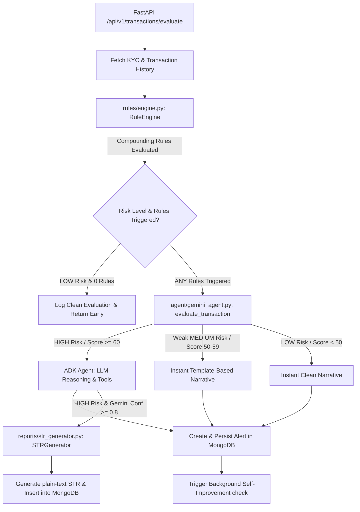

# EagleEyes Project Context

This document provides a comprehensive overview of **EagleEyes — Autonomous Self-Improving AML Platform**, detailing the system architecture, entry points, data models, primary API surfaces, compliance rules engine, and self-improvement loops. This context serves as a guide for understanding the relationships, mechanics, and design decisions of the codebase.

---

## 1. System Architecture & Components

EagleEyes is structured as a modular backend application built with **FastAPI** and **MongoDB** (Async Motor Client), orchestrating a hybrid compliance pipeline that combines a compounding rules engine with an LLM reasoning agent powered by **Google Agent Development Kit (ADK)** and **Gemini 3.5 Flash**.



### Core Components
*   **Compounding Rules Engine ([rules/engine.py](file:///C:/Users/hussain/Desktop/projects/eagle-eyes/rules/engine.py))**: Evaluates transactions against 12 custom, CBK-aligned compliance rules. It generates a base score and applies multiplier factors based on sender velocity, recurrence patterns, and network graph characteristics.
*   **ADK Compliance Agent ([agent/eagleeyes_agent/agent.py](file:///C:/Users/hussain/Desktop/projects/eagle-eyes/agent/eagleeyes_agent/agent.py))**: A reasoning agent configured with the Google Agent Development Kit and standard tools. For flagged transactions that exceed risk thresholds, it performs dynamic verification and outputs structured compliance reasoning.
*   **Arize Phoenix Tracing and Observability ([integrations/arize_client.py](file:///C:/Users/hussain/Desktop/projects/eagle-eyes/integrations/arize_client.py))**: Auto-instruments ADK agents and custom spans via OpenTelemetry, pushing traces to Arize Phoenix. It includes a custom LLM-as-a-Judge evaluator using `phoenix.evals` that runs in the background.
*   **Model Context Protocol (MCP) Tools Registry ([integrations/mongodb_mcp.py](file:///C:/Users/hussain/Desktop/projects/eagle-eyes/integrations/mongodb_mcp.py))**: Exposes database operations and stats as standard MCP tools. At runtime, the self-improvement loop launches `@arizeai/phoenix-mcp` over stdio to fetch telemetry traces.
*   **MLOps Self-Improvement Loop ([agent/self_improvement.py](file:///C:/Users/hussain/Desktop/projects/eagle-eyes/agent/self_improvement.py))**: Periodically queries Phoenix trace data and MongoDB audit logs to analyze rule performance, suggest weight calibrations, suggest keyword additions/removals, and adjust thresholds.
*   **Suspicious Transaction Report (STR) Document Generator ([reports/str_generator.py](file:///C:/Users/hussain/Desktop/projects/eagle-eyes/reports/str_generator.py))**: Generates standardized plain-text Suspicious Transaction Reports (STRs) matching the formatting expectations of the Financial Intelligence Unit (FIU) under the Central Bank of Kuwait (CBK).
*   **FastAPI API Daemon ([main.py](file:///C:/Users/hussain/Desktop/projects/eagle-eyes/main.py) & [api/routes.py](file:///C:/Users/hussain/Desktop/projects/eagle-eyes/api/routes.py))**: Exposes REST endpoints, registers lifecycle handlers, mounts the static UI console, and configures middlewares for request logging and CORS.
*   **Interactive Compliance Console ([ui/dashboard.html](file:///C:/Users/hussain/Desktop/projects/eagle-eyes/ui/dashboard.html))**: A glassmorphic frontend console serving real-time statistics, pending alert queues, decision execution actions, STR document viewers, and sandbox seeding controls.

---

## 2. System Entry Points

*   **FastAPI Web Service ([main.py](file:///C:/Users/hussain/Desktop/projects/eagle-eyes/main.py))**: 
    The primary daemon that starts the HTTP server. It manages connection lifespans for MongoDB, starts Phoenix in-process when in `development` mode, setups global tracing, and redirects the root route `/` to `/dashboard.html` while mounting the static frontend assets from [ui/](file:///C:/Users/hussain/Desktop/projects/eagle-eyes/ui).
*   **Synthetic Data Seeder ([data/generator.py](file:///C:/Users/hussain/Desktop/projects/eagle-eyes/data/generator.py))**: 
    A CLI seeder that generates expat demographics (using Civil ID patterns, monthly incomes, and visa residency articles) and seeds MongoDB with realistic transactions containing specific suspicious indicators (such as visa breaches, structured rings, repeat flags, etc.).
*   **System Verification Tests ([scratch/test_self_improvement.py](file:///C:/Users/hussain/Desktop/projects/eagle-eyes/scratch/test_self_improvement.py))**: 
    A comprehensive script used to test the compounding rule engine, dynamic MongoDB config overrides, cache TTL limits, MLOps self-improvement loops, and mathematical precision calculations.

---

## 3. Core Data Models ([data/models.py](file:///C:/Users/hussain/Desktop/projects/eagle-eyes/data/models.py))

All data records flow through strict Pydantic schemas enforcing constraints and type safety:

### `CustomerType` (Enum)
Classifies senders for KYC rules:
*   `kuwaiti`: Local citizens.
*   `resident`: Expats holding a Civil ID and a residency visa article (e.g., Article 18, 22).
*   `tourist`: Visitors holding a Passport (no residency article).
*   `corporate`: Corporate entities or business accounts.

### `SenderProfile`
Represents customer KYC data captured at onboarding:
*   `sender_id` (str): Civil ID or Passport number (primary key).
*   `nationality` (str): ISO 3166-1 alpha-2 code (e.g., `'EG'`, `'PH'`).
*   `customer_type` (`CustomerType`): Enum value.
*   `residency_article` (Optional[str]): String article number (`'18'`, `'22'`, etc.).
*   `monthly_income_kd` (Optional[float]): Declared monthly salary.
*   `is_pep` (bool): True if identified as a Politically Exposed Person.
*   **Computed Properties**:
    *   `yearly_income_kd`: Returns `monthly_income_kd * 12` if available.
    *   `is_minor`: Computes age dynamically from `date_of_birth` and returns True if under 18 years old.

### `Transaction`
Represents an individual remittance transaction intercepted at the branch:
*   `ref_no` (str): Unique reference ID (primary key).
*   `amount_kd` (float): Remitted amount converted to Kuwait Dinar.
*   `sender_id` (str): Foreign key linking to `SenderProfile`.
*   `acc_number` (str): Recipient account number.
*   `recipient_country` (str): Destination country code.
*   `recipient_is_company` (bool): If the recipient is a corporate entity.
*   `transaction_purpose` (str): Declared remittance purpose.
*   `proof_of_wealth_provided` (bool): Flag indicating if supporting wealth documents are uploaded.

### `RuleViolation`
Represents an active rule triggered by the rule engine:
*   `rule_id` (str): The identifier of the triggered rule (e.g., `'INCOME_MISMATCH'`).
*   `rule_name` (str): Human-readable name.
*   `base_weight` (float): The base weight score configured for this rule at evaluation time.
*   `contributing_factors` (List[str]): Context details and supporting math.

### `RiskScore`
Aggregates the result of the rule engine:
*   `base_score` (float): Sum of base weights of all triggered rules.
*   `behavior_multiplier` (float): Velocity/income severity multiplier (1.0 to 2.5).
*   `recurrence_multiplier` (float): Repeat offense multiplier (1.0 to 2.0).
*   `network_multiplier` (float): Shared identifier network multiplier (1.0 to 2.0).
*   `final_score` (float): `base_score * multipliers`, capped at `100.0`.
*   `risk_level` (str): `'LOW'`, `'MEDIUM'`, or `'HIGH'`.
*   `rules_triggered` (List[`RuleViolation`]): Details of each active violation.

### `Alert`
Generated when a transaction is flagged by the compliance pipeline:
*   `alert_id` (str): Unique UUID (primary key).
*   `ref_no` (str): Reference link to `Transaction`.
*   `risk_score` (`RiskScore`): Evaluated risk results.
*   `gemini_reasoning` (str): Narrative analysis text returned by Gemini.
*   `gemini_confidence` (float): Agent confidence score (0.0 to 1.0).
*   `status` (str): `'PENDING'`, `'REVIEWED_CLEARED'`, `'REVIEWED_ESCALATED'`, or `'STR_FILED'`.
*   `arize_trace_id` (Optional[str]): Tracing ID linking to Arize Phoenix.

### `STRReport`
Represents an official Suspicious Transaction Report:
*   `str_id` (str): Unique reference formatted as `STR-{BRANCH}-{YYYYMMDD}-{SEQ}`.
*   `str_content` (str): Monospace plain-text report payload containing CBK regulatory sections.

---

## 4. Compounding Compliance Rules ([rules/engine.py](file:///C:/Users/hussain/Desktop/projects/eagle-eyes/rules/engine.py))

EagleEyes evaluates transactions against 12 custom rules with dynamic weights loaded from MongoDB (falling back to constants in [core/constants.py](file:///C:/Users/hussain/Desktop/projects/eagle-eyes/core/constants.py)):

| Rule ID | Rule Name | Base Weight | Threshold / Condition |
| :--- | :--- | :---: | :--- |
| **`SANCTIONED_COUNTRY`** | Sanctioned Country | `100` | Recipient country matches sanctioned list (`'IR'`, `'IRN'`, `'Iran'`, etc.) |
| **`STRUCTURING_MULTI_SENDER`** | Structuring Multi-Sender | `97` | Multi-senders send to same account below cash limit (`3,000 KD`), but combined sum > `3,000 KD` in 1D, 7D, or 30D window. |
| **`SHARED_IDENTIFIER_NETWORK`** | Shared Identifier Network | `94` | Multi-senders sharing phone/address send to same account with combined sum > `3,000 KD`. |
| **`REPEAT_FLAGS`** | Repeat Flags | `90` | Sender has triggered 3 or more alerts in the last 30 days. (Triggers risk auto-escalation). |
| **`INCOME_MISMATCH`** | Income Mismatch | `87` | Txn amount, monthly total, or yearly total exceeds declared KYC monthly/annual income. |
| **`TOURIST_NO_POW`** | Tourist No Proof of Wealth | `83` | Tourist visa holder remits $\ge$ `1,000 KD` without uploading Proof of Wealth. |
| **`ARTICLE_22_BREACH`** | Article 22 Breach | `80` | Article 22 (Family Dependent) visa holder exceeds `150 KD` monthly or `1,000 KD` yearly limits. |
| **`NON_HOME_CORRIDOR`** | Non-Home Corridor | `72` | Resident expat remits to non-home nationality country (without exceptions). |
| **`CORPORATE_PURPOSE_MISMATCH`**| Corporate Purpose Mismatch | `69` | Corporate sender has personal purpose or lacks standard company name suffix. |
| **`INDIVIDUAL_TO_COMPANY`** | Individual to Company | `65` | Individual sender remits to corporate account without education/medical exemptions. |
| **`VAGUE_PURPOSE`** | Vague Purpose | `58` | Stated purpose is short (< 5 chars) or matches vague keywords (e.g., `'general'`). |
| **`MINOR_SENDER`** | Minor Sender | `50` | Sender is under 18 years old at transaction date. |

### Mathematical Multipliers (Compounding Risk)
The final risk score is computed as:
$$\text{Final Risk Score} = \min\left(100.0, \, \text{Base Score} \times \text{Behavior Multiplier} \times \text{Recurrence Multiplier} \times \text{Network Multiplier}\right)$$

*   **Behavior Multiplier** (Starts at `1.0`):
    *   $+0.3$ if sender has $\ge 3$ transactions in the last 24 hours.
    *   $+0.3$ if sender has $\ge 5$ transactions in the last 7 days.
    *   $+0.5$ (Day) / $+0.3$ (Week) / $+0.1$ (Month) for structuring velocity signals.
    *   $+0.5$ if monthly transaction total exceeds **3×** declared monthly income (or $+0.2$ for **2×**).
    *   $+0.3$ if annual total exceeds declared annual income.
    *   $+0.5$ if Article 22 dependent breaches **both** monthly and yearly limits (or $+0.3$ for yearly only).
*   **Recurrence Multiplier** (Starts at `1.0`):
    *   $+0.5$ if sender has exactly 2 alerts in the last 30 days.
    *   $+1.0$ if sender has $\ge 3$ alerts in the last 30 days.
*   **Network Multiplier** (Starts at `1.0`):
    *   $+0.5$ if recipient account receives money from another sender sharing a phone or address.
    *   $+0.5$ more (total $+1.0$) if those co-senders share both the identifier and nationality.

### Auto-Escalation Override
If `REPEAT_FLAGS` triggers, the transaction is **auto-escalated** to a minimum risk level of **`MEDIUM`**, bypassing score calculation fallbacks.

---

## 5. Decision Gating & Performance Optimizations

### 1. Gemini Call Gating
To control API costs and latency, Gemini evaluation is gated by the rules engine score:
*   **HIGH Risk** or **Strong MEDIUM Risk** ($\text{Score} \ge 60$): Escalates to the ADK agent for LLM-based narrative generation and context retrieval.
*   **Weak MEDIUM Risk** ($50 \le \text{Score} < 60$): Returns a pre-built static narrative recommending manual compliance officer monitoring.
*   **LOW Risk** ($\text{Score} < 50$): Automatically clears the transaction and returns a static low-risk narrative.

### 2. Request-Scoped In-Memory Batch Cache
During batch evaluations (which execute concurrently via `asyncio.gather`), redundant queries are eliminated by wrapping database operations:
*   `enable_batch_cache()` is called on request initialization, mapping keys as `"fn_name:arg1:arg2"`.
*   Cached functions include: `get_sender_transaction_history`, `get_recipient_network`, `get_sender_alert_history`, and `get_sender_annual_total`.
*   `disable_batch_cache()` is executed inside a `finally` block on request completion.

### 3. Live configuration caching
To reduce database queries on individual sequential transactions, rule weights, thresholds, and keyword collections are loaded via an in-memory configuration cache in [agent/self_improvement.py](file:///C:/Users/hussain/Desktop/projects/eagle-eyes/agent/self_improvement.py) with a **60-second Time-To-Live (TTL)**. When a compliance officer approves a self-improvement calibration, cache handles are set to `None`, forcing the system to reload active settings on the next transaction run.

### 4. Self-Improvement Loop & Collection Naming Corrections
To support correct querying on both `MongoClient` wrapper instances and raw `AsyncIOMotorDatabase` objects (like FastAPI request dependencies), a robust helper `get_motor_db` is implemented in [agent/self_improvement.py](file:///C:/Users/hussain/Desktop/projects/eagle-eyes/agent/self_improvement.py). This prevents the system from mapping raw databases to sub-collections (e.g. `db.alerts` instead of `alerts`) and resolves the database namespace bug.
Additionally, the timeout for the self-improvement loop in [agent/self_improvement.py](file:///C:/Users/hussain/Desktop/projects/eagle-eyes/agent/self_improvement.py) is set to **120.0 seconds** to avoid timeout interruptions during deep LLM analysis.

### 5. Unique Disposable Sessions & Resource Cleanup
To prevent session-ID collisions (e.g. `Session with id eval-... already exists` errors) when re-running transactions during batch evaluations, the compliance agent builds a unique disposable session ID per evaluation run: `session_id = f"eval-{transaction.ref_no}-{uuid.uuid4().hex[:8]}"`.
To keep the `InMemorySessionService` resource consumption bounded, sessions are actively deleted on evaluation completion. Inside `evaluate_transaction`'s `finally` block, after closing the async generator, `await session_service.delete_session(app_name="eagleeyes", user_id=user_id, session_id=session_id)` is invoked. The call is wrapped in its own guarded `try/except` block to ensure cleanup issues never mask actual agent execution errors.

---

## 6. Tracing & LLM-as-a-Judge ([integrations/arize_client.py](file:///C:/Users/hussain/Desktop/projects/eagle-eyes/integrations/arize_client.py))

*   **OTel Span Hierarchy**:
    ```text
    transaction_evaluation (Root Span)
    ├── rule_engine_evaluation (Child Span)
    ├── gemini_reasoning (Child Span - auto-instrumented via GoogleADKInstrumentor)
    └── alert_decision (Child Span)
    ```
*   **Span Attributes for Trace Correlation**:
    To support downstream MLOps self-improvement loop joins without ambiguity, every evaluation span is stamped with `transaction.ref_no` (the stable transaction correlation key) and `run_id` (a UUID representing the batch-run or single-run context) around the ADK agent call.
*   **LLM-as-a-Judge Evaluation (Temporarily Mocked)**:
    *   *Standard Operation*: Runs the custom `compliance_narrative_alignment` classifier using `phoenix.evals.create_classifier` backed by Gemini. It audits recent compliance narratives by matching inputs (rules and customer context) against outputs (narrative reasons) and logs annotations to Phoenix using `spans.log_span_annotations_dataframe`.
    *   *Demo Sandbox Mode*: For demonstration and hackathon runs, the evaluations are **temporarily mocked** to instantly return `1.0` to speed up sandbox batch executions from over 1.5 minutes to under 20 seconds.
*   **Windows & Cross-Platform MCP Client Compatibility**:
    To support local execution on Windows developers' environments, the MCP connection setup is optimized to dynamically run `npx.cmd` on `win32` platforms and `npx` on Linux/other environments.
*   **Compliance Alignment Gating**:
    *   If the average LLM-as-a-Judge alignment score drops below **`0.80` (80%)**, self-improvement updates are strictly blocked.
    *   The report's `confidence_assessment` is forced to `"LOW"` and a warning flag is raised.
    *   Live deployment of weights is rejected by API rules if a report contains warning flags or `"LOW"` confidence.

---

## 7. Primary API Surfaces ([api/routes.py](file:///C:/Users/hussain/Desktop/projects/eagle-eyes/api/routes.py))

### Transactions Enclave
*   `POST /api/v1/transactions/evaluate`
    Evaluates a single transaction. Validates KYC records, queries history, computes risk, runs the ADK agent if needed, updates telemetry, and inserts pending alerts.
*   `POST /api/v1/transactions/batch`
    Evaluates a list of transactions (max 100) concurrently using `asyncio.gather` with a semaphore of `5` to limit API rate usage. Supports `stop_on_high_risk` to act as a batch execution circuit breaker.

### Alerts Dashboard Enclave
*   `GET /api/v1/alerts`
    Retrieves pending compliance alerts. Supports filtering by risk level.
*   `GET /api/v1/alerts/{alert_id}`
    Retrieves complete alert metadata and agent reasoning.
*   `PATCH /api/v1/alerts/{alert_id}/review`
    Logs human reviewer decisions (`REVIEWED_CLEARED`, `REVIEWED_ESCALATED`, `STR_FILED`). Can trigger `STRGenerator` to compile the FIU plaintext report.
*   `GET /api/v1/alerts/{alert_id}/str`
    Fetches the plain-text Suspicious Transaction Report.

### Customer KYC Onboarding Enclave
*   `GET /api/v1/customers/{sender_id}`
    Fetches KYC details.
*   `POST /api/v1/customers`
    Onboards a new customer profile.

### MLOps Self-Improvement Enclave
*   `GET /api/v1/improvement/latest`
    Retrieves the latest pending self-improvement report comparing current vs suggested weights.
*   `POST /api/v1/improvement/{report_id}/apply`
    Applies the report's calibrations live to active MongoDB collections. Blocked if the report contains a `"LOW"` confidence assessment or warning flags.

### Stats and Demo Enclaves
*   `GET /api/v1/stats`
    Aggregates dashboard stats (evaluated counts, alerts, STRs, YTD false-positive rate, active weights).
*   `POST /api/v1/demo/load-sample-data`
    Clears MongoDB and seeds sample data (100 expat profiles, 600 transactions with seeded violations).
    Streams batch evaluation progress log events as **Server-Sent Events (SSE)**, flushing tracing spans and invoking self-improvement loops upon hitting the evaluation threshold. Exceptions and evaluation failures are recorded directly in the database `evaluation_log` (with `"status": "failed"` and `risk_level="ERROR"`), streamed to the console as `[ERROR] Failed evaluating ...` messages (under `"status": "failed"` chunks), and tracked separately under the `"failed"` key in Completed and Cancelled summaries (excluding failed runs from the `"evaluated"` count).

---

## 8. Containerization & Cloud Deployment

### Docker Container Environment
The application is containerized using the [Dockerfile](file:///C:/Users/hussain/Desktop/projects/eagle-eyes/Dockerfile) based on `python:3.12-slim`. To support the Arize Phoenix MCP server integration, the container environment is explicitly configured with:
*   **Node.js & npm/npx**: Installed directly via the NodeSource repository (version 20) inside the container. This is a strict requirement for the self-improvement loop ([agent/self_improvement.py](file:///C:/Users/hussain/Desktop/projects/eagle-eyes/agent/self_improvement.py)) to spawn the `@arizeai/phoenix-mcp` server using `npx` over a stdio connection.
*   **Build Optimization**: A [.dockerignore](file:///C:/Users/hussain/Desktop/projects/eagle-eyes/.dockerignore) file ignores `.venv`, `.git`, local log files, and scratch scripts to keep the Docker build context minimal and fast.

### Cloud Run Hosting Configuration
When hosted on **Google Cloud Run**, local databases and in-process servers are replaced with serverless cloud services to ensure stateless scalability and persistence:
*   **MongoDB Database**: Configured to connect to **MongoDB Atlas** (cloud cluster) by updating the `MONGODB_URI` environment variable.
*   **Arize Phoenix Observability**: Traces and LLM evaluations are sent directly to **Arize Phoenix Cloud (SaaS)**. This is configured by setting `PHOENIX_COLLECTOR_ENDPOINT=https://app.phoenix.arize.com` and providing a valid `PHOENIX_API_KEY` in the environment variables.

